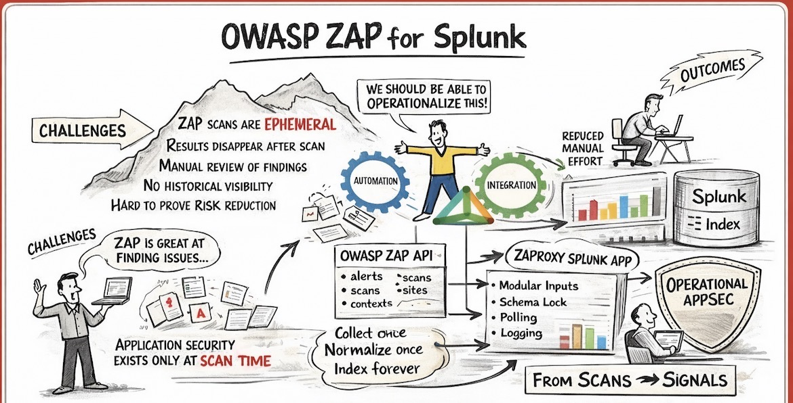

# OWASP ZAP For Splunk App




## Introduction

OWASP Zed Attack Proxy (ZAP) is a leading open-source web application security testing platform maintained by the Open Web Application Security Project (OWASP). It provides automated and manual testing capabilities for identifying vulnerabilities in web applications, APIs, and services.

OWASP ZAP for Splunk enables centralized ingestion, normalization, and operationalization of ZAP scan data directly within Splunk—without reliance on the ZAP desktop interface.

Official Project: https://www.zaproxy.org

---

## Overview

OWASP ZAP for Splunk integrates web application security scan telemetry into Splunk using API-based data collection and structured report ingestion.

This Splunk App enables security teams to:

- Monitor web application vulnerability posture  
- Track scan execution and coverage  
- Operationalize findings into remediation workflows  
- Perform trend and exposure analytics  
- Integrate with SIEM/SOAR environments  

---


⚠️ Disclaimer
This tool is not an official ZAP https://www.zaproxy.org/ product

Use of this software is not covered by any license, warranty, or support agreement you may have with Checkmarx.
All functionality is implemented independently using publicly available Zed Attack Proxy (ZAP) API by Checkmarx documentation.
https://www.zaproxy.org/docs/api/


---

## Key Functions & Features

- **Automated Scan Ingestion**: Pull alerts, sites, and scan metadata via ZAP API
- **Structured Report Parsing**: Support for JSON and XML report formats
- **Risk Normalization**: Standardized severity mapping (High, Medium, Low, Informational)
- **Scan Lifecycle Tracking**: Active, passive, completed scans
- **Evidence Preservation**: Raw alert evidence retained for investigation

---

## Supported Data Types

OWASP ZAP provides visibility into the following assets and metadata:

- Scan Alerts
- Alert Severity and Confidence
- CWE Identifiers
- WASC Identifiers
- Affected URLs
- HTTP Request/Response Evidence
- Parameters Tested
- Attack Vectors
- Plugin IDs
- Site Trees
- Spider Results
- Active Scan Results
- Passive Scan Results
- API Scan Results

---

## 🛡️ Core Capabilities

| Feature | Description |
|------|-------------|
| 🌐 Web Application Scanning | Active and passive vulnerability detection |
| 🔍 Alert Normalization | Structured risk mapping |
| 🧭 Evidence Visibility | Full HTTP request/response context |
| 🧬 CWE Mapping | Industry-standard weakness tracking |
| 🧾 Raw Retention | Original API payload preserved |

---

## 📈 Analytics and Visibility

| Feature | Description |
|------|-------------|
| 📊 Vulnerability Trends | Risk over time tracking |
| 🔄 First-Seen Detection | Newly identified findings |
| 🧱 URL Risk Distribution | Vulnerabilities by endpoint |
| 🔐 Severity Breakdown | Risk distribution by level |
| 🧠 Scan Coverage Monitoring | Site and endpoint coverage |

---

## ⚙️ Operational Excellence

| Feature | Description |
|------|-------------|
| 📡 Modular Input Framework | Secure REST API ingestion |
| 🔑 API Key Management | Secure credential storage |
| 🌐 Proxy Support | Enterprise proxy compatibility |
| 🩺 Health Monitoring | API connectivity verification |
| 📋 Ingestion Logging | Full operational traceability |
| ⏱️ Controlled Polling | Scan-aware scheduling |

---

## 📊 Dashboards

| Dashboard | Description |
|---------|-------------|
| Overview | High-level vulnerability summary |
| Alerts | Detailed alert inventory |
| Severity Breakdown | Risk distribution view |
| CWE Mapping | Weakness classification |
| Affected URLs | Endpoint exposure analysis |
| Scan Activity | Scan lifecycle monitoring |
| Trends | Vulnerability trending |
| Operations | Ingestion and API health |


---

# OWASP ZAP for Splunk App  
## Sourcetype → Dashboard Mapping

### 🟦 Core Scan Data

| Sourcetype | Dashboards |
|-----------|------------|
| `zap:alert` | Overview, Alerts |
| `zap:alert:evidence` | Alerts Detail |
| `zap:scan` | Scan Activity |
| `zap:site` | Affected URLs |
| `zap:spider` | Spider Results |

---

### 🟨 Vulnerability Context

| Sourcetype | Dashboards |
|-----------|------------|
| `zap:cwe` | CWE Mapping |
| `zap:wasc` | WASC Mapping |
| `zap:risk:distribution` | Severity Breakdown |

---

### 🟥 Operational & API Health

| Sourcetype | Dashboards |
|-----------|------------|
| `zap:api:status` | Health |
| `zap:ingestion:metric` | Operations |
| `zap:error` | Error Tracking |

---

## Deployment

### Step 1: Install the App

1. Download `OWASP_ZAP_For_Splunk_App-1.0.0.tar.gz`
2. In Splunk Web, go to **Apps → Manage Apps**
3. Select **Install app from file**
4. Upload the package
5. Restart Splunk if prompted

---

### Step 2: Configure the App

Navigate to:

**Apps → OWASP ZAP for Splunk → Setup**

Configure:

- ZAP API endpoint (e.g., http://zap-host:8080)
- API key
- Polling interval
- Target index (e.g., index=zap)

All inputs are disabled by default.

---

### Step 3: Validate Configuration

- Verify API authentication
- Confirm API key access
- Validate scan permissions

---

### Step 4: Verify Data Collection

Run:

```
index=zap
| stats count by sourcetype
```

Confirm events are populating expected sourcetypes.

---

## License

OWASP ZAP is licensed under Apache License 2.0.

This Splunk App is independently developed and is not an official OWASP Foundation product unless explicitly stated otherwise.
